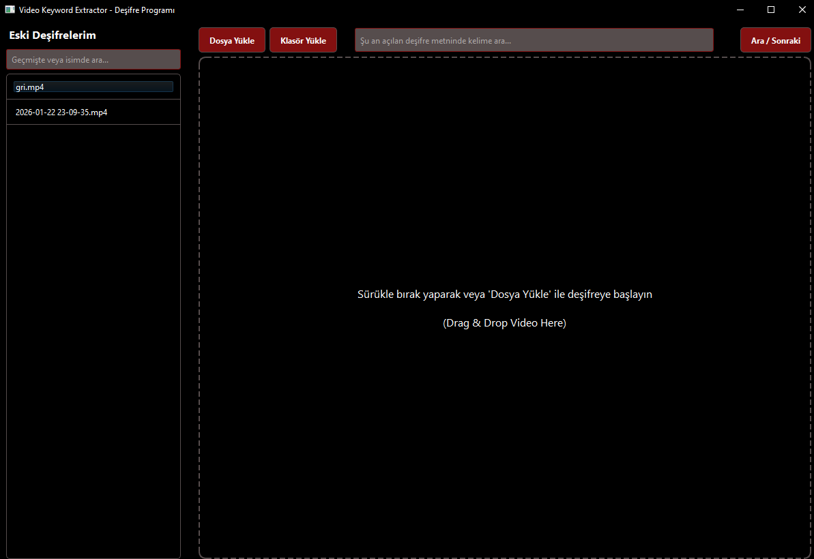
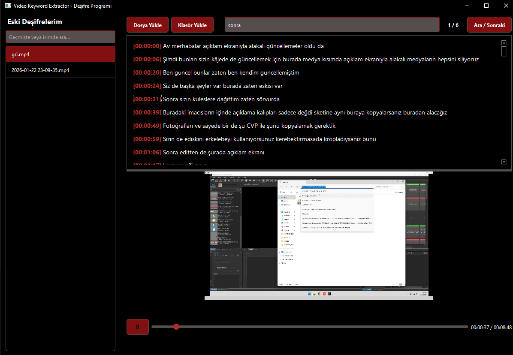

# Video Keyword Extractor & Transcriber 🎥

[English description is available below.](#english-description)

**Video Keyword Extractor**, bilgisayarınızdaki videoları analiz ederek (deşifre/transkripsiyon) diyalogları metne dönüştüren ve bu metinler içinde arama yaparak sizi videonun o saniyesine taşıyan, modern arayüzlü (PyQt6) bir Python masaüstü uygulamasıdır. Arka planda **OpenAI Whisper** modelini kullanarak oldukça yüksek bir doğruluk payıyla yerel cihazınızda deşifre işlemi yapar.





## 🌟 Özellikleri

- **Hızlı Deşifre (Transcription):** Arka planda (Thread) çalışan Whisper yapay zekası sayesinde UI donmadan hızlı ve stabil deşifre.
- **Toplu İşlem Desteği:** Klasör yükleyerek içindeki desteklenen (`.mp4, .mkv, .avi, .mov`) tüm videoları arka arkaya sıralı şekilde otomatik deşifre edebilme.
- **Dinamik Medya Oynatıcısı:** Metinde ilgili diyalogun zaman damgasına tıklandığında (örn: `[00:03:15]`) videonun otomatik olarak o noktaya sarılması.
- **Akıllı Arama İşlevleri:**
  - *Aktif Deşifre İçi Arama:* Anlık videoda kelime aradığınızda, kaç defa geçtiğini sayar (`1 / 4`) ve her enter/ara butonuna basışınızda metin içindeki bir sonraki sonuca atlar.
  - *Geçmişte Arama (Sidebar):* Daha önce deşifre edilen videoların sadece isimlerinde değil, aynı zamanda kaydedilen `.txt` dosyalarının içeriğinde (eski deşifrelerde) arama yapma ve o videoya anında erişim.
- **Lokal Veritabanı:** JSON tabanlı hafif bir bellek sistemiyle, önceden yüklenmiş videolara arayüzden tek tıkla geri dönme imkanı.
- **Kişiselleştirilmiş "Dark-Red" Tema:** Siyah ve kırmızı tonlarının harmanlanıp kusursuz göründüğü profesyonel UI tasarımı.

## 🚀 Kurulum & Çalıştırma

1. **Gereksinimler:** Projede OpenAI Whisper modeli çalıştığı için, sisteminizde [FFmpeg](https://ffmpeg.org/download.html)'in kurulu olması ve PATH değişkenine eklenmiş olması gerekmektedir.
2. Bu depoyu bilgisayarınıza kopyalayın.
3. Bağımlılıkları kurun:
    ```bash
    pip install -r requirements.txt
    ```
4. Uygulamayı çalıştırın:
    ```bash
    python main.py
    ```

---

<br>

<a name="english-description"></a>
# Video Keyword Extractor & Transcriber (English)

**Video Keyword Extractor** is a local Python desktop application built with **PyQt6** and **OpenAI Whisper**. It seamlessly transcribes offline videos, extracts dialogue into an interactive rich text view, and perfectly synchronizes it with an embedded video player. 

## 🌟 Key Features

- **Local AI Transcription:** Uses OpenAI's `whisper` model in a background thread to prevent GUI freezing. Provides fully local processing with time-coded sentences.
- **Batch Processing:** Drop a single file or an entire folder of videos. The app queues multiple items and processes them sequentially with an updating progress bar.
- **Interactive Timeline Sync:** Clicking any generated timestamp in the transcript area (e.g. `[00:01:23]`) automatically seeks the video player to that exact second.
- **Advanced Search Mechanisms:**
  - *In-text Search:* Find keywords in the current transcript, loop through occurrences by pressing Enter (e.g., `2 / 5`), and navigate smoothly.
  - *Global History Search (Sidebar):* Not only filters past videos by file name, but actively searches the deep content of previously saved `.txt` files to bring up relevant past transcriptions globally.
- **Offline History Logging:** Maintains a JSON ledger of previously processed video files and transcriptions, allowing single-click retrieval on fresh reboots.
- **Custom Aesthetic UI:** Sleek, modern "Dark & Crimson Red" bespoke PyQt6 stylesheet integration.

## 🚀 Setup & Usage

1. **System Prerequisite:** You must have [FFmpeg](https://ffmpeg.org/download.html) installed locally and added to your systemic PATH for `openai-whisper` encoding/decoding capabilities.
2. Clone this repository to your local machine.
3. Install the specific python dependencies:
    ```bash
    pip install -r requirements.txt
    ```
4. Run the app:
    ```bash
    python main.py
    ```
